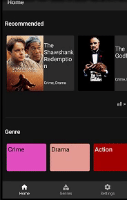

# Clean Movies

An app that shows list of movies

Uses following architectures:

* Clean architecture
* MVVM

### Tools and libraries

- [[**Kotlin coroutines**](https://kotlinlang.org/docs/reference/coroutines-overview.html)]
- [[**Gradle Kotlin Dsl**](https://docs.gradle.org/current/userguide/kotlin_dsl.html)]
- [[**Hilt**](https://developer.android.com/training/dependency-injection/hilt-android)]
- [[**Jetpack compose**](https://developer.android.com/jetpack/compose/tutorial)]
- [[**Navigation (with compose)**](https://developer.android.com/jetpack/compose/navigation)]
- [[**Retrofit and OKHttp**](https://square.github.io/retrofit/)]
- [[**Moshi**](https://github.com/square/moshi)]
- [[**Jetpack proto DataStore**](https://developer.android.com/topic/libraries/architecture/datastore)]

